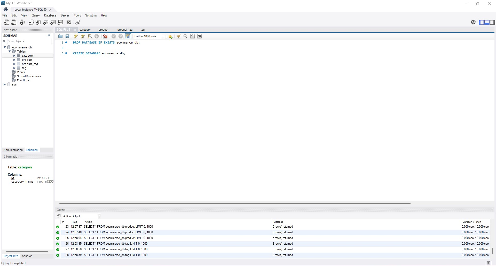

# Ecommerce Back-End Application

## Description
The Ecommerce Back-End Application is designed to set a foundation for an ecommerce business. Using modularization, models, and multiple API calls, the back-end is set up for continuous integration and continuous development. To continue development, it will need a front-end for administrative users. There are so many Ecommerce websites out there, but not many can be accessed for free. This project is for those people out there who are starting off small. 

Through developing this project, I learned the dichotomy of a complex/easy to read set of directory structuring. Although using multiple directories with multiple files looks complicated, it's a great way to create easy readability and modularization for future development. 

## Installation
After cloning the repository to your local machinie, go to your terminal, in the root direcory of the project, and run `npm i`. That will download the node packages necessary to run the application. Once the node packages are downloaded, please review the usage section below. Make sure to create a .env file with the database name (`DB_NAME='ecommerce_db'`), your local database username (`DB_USER`), and your local database password (`DB_PW`). Place the .env file at the root of your local repository.

## Usage
1. Open your MySQL Workbench and run the command, `CREATE DATABASE ecommerce_db`
2. Open your command terminal and navigate to the root of the ecommerce project repository. 
3. Run the command `npm run seed`. This command will seed the database with example data (optional).
4. Watch the video below to learn how to use the API calls. 

